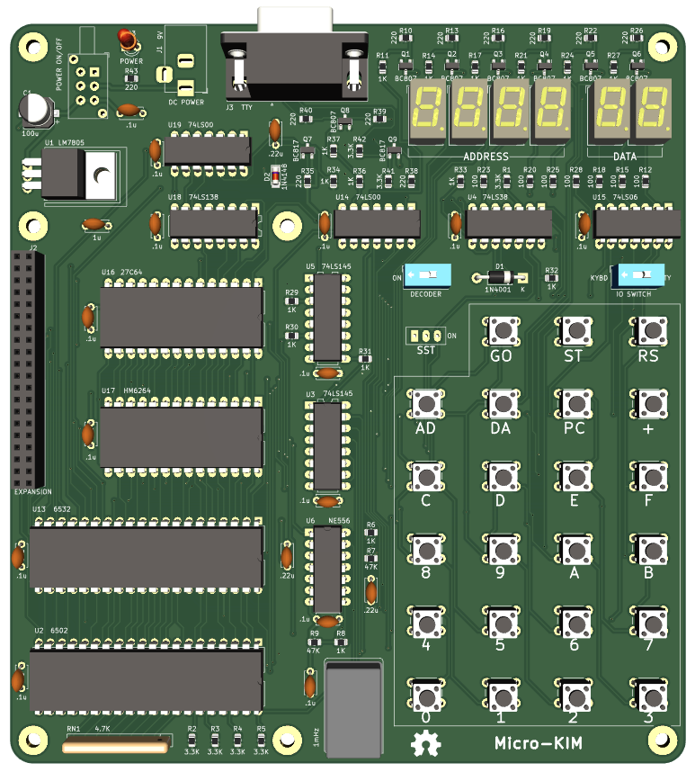

### Micro-KIM REV1

Клон KIM-1.


### Спецификация и отличия от KIM-1:
- Процессор 6502 работает на частоте 1 МГц.
- 8K EPROM заменяет встроенное ПЗУ на 6530-х, доступно 2К.
- 8К RAM с использованием карты памяти KIM-1, доступно 5К.
- Интерфейс RS232 адаптирован для работы с TIM, встроенным в KIM-1.
- 40-контактный разъем для подключения расширений.
- Магнитофонный интерыейс убран, можно подключить как расширение.


### Карта памяти с отличиями от оригинала:
| Адреса Micro-KIM | Адреса KIM-1 |
|------------------|--------------|
|$0000-$03FF 	1024 Bytes of RAM 	|$0000-$03FF 	1024 Bytes of RAM|
|$0400-$07FF 	1024 Bytes of RAM 	|$0400-$07FF 	Optional Memory Area|
|$0800-$0BFF 	1024 Bytes of RAM 	|$0800-$0BFF 	Optional Memory Area|
|$0C00-$0FFF 	1024 Bytes of RAM 	|$0C00-$0CFF 	Optional Memory Area|
|$1000-$13FF 	1024 Bytes of RAM 	|$1000-$13FF 	Optional Memory Area|
|$1400-$16FF 	Optional Memory Area 	|$1400-$16FF 	Optional Memory Area|
|$1700-$173F 	Optional 2nd 6532 I/O, Timer 	|$1700-$173F 	6530-002 I/O, Timer|
|$1740-$177F 	6532 I/O and Timer 	|$1740-$177F 	6530-003 I/O, Timer|
|$1780-$17BF 	64 Bytes RAM from 6532 	|$1780-$17BF 	64 Bytes from 6530-003|
|$17C0-$17FF 	64 Bytes RAM from 6532 * 	|$17C0-$17FF 	64 Bytes from 6530-002|
|$1800-$1BFF 	1024 Bytes of EPROM 	|$1800-$1BFF 	1024 Bytes of ROM in 6530-003|
|$1C00-$1FFF 	1024 Bytes of EPROM 	|$1C00-$1FFF 	1024 Bytes of ROM in 6530-002|
|$2000-$FFFF 	Unused memory 	|$2000-$FFFF 	Unused memory or 32K RAM baord|

*6532 имеет 128 байт ОЗУ по сравнению с 64 байтами на 6530. Micro-KIM использует все 128 байт из единственного встроенного 6532, поэтому доступны все исходные ячейки памяти.

**Важно, для адаптации RS232 к TLL USB неоходимо внести зменения:**
1) Выпаять или не впаивать следующие элементы:
    - R35 220, R37 1K, R38 220, R39  220, R40 220, R41 3.3K
    - Q8 BC80, Q9 BC817
    - C18 .22u
    - D2 4148

2) Впаять перемычки:
    - R36 1K, вывод который был подключен к базе Q8, подключить к ноге 2 разъема J3
    - R42 3.3K, вывод который был подключен к базе Q9, подключить к базе Q7

### 6502 компилятор.
http://www.cc65.org

### SRECORD утилита для подготовкий файлов в MOS формате.
http://srecord.sourceforge.net

### Пример make файла для Windows.
```
SET PATH=[ПУТЬ КУДА УСТАНОВЛЕН СС65]\bin;[ПУТЬ КУДА УСТАНОВЛЕН srecord]\bin;%PATH%
ca65 -g -l kim.lst --feature labels_without_colons kim.s
ld65 -t none -vm -m kim.map -o kim.bin kim.o
srec_cat kim.bin -binary -offset 0x1800 -o kim.ptp -MOS_Technologies
```

### BOM
| Обозначение                                            | Значение | Кол-во |
|--------------------------------------------------------| -------- |--------|
|C1|100u 50V|1|
|C2, C6-C17, C19|.1u|1|4|
|C3|1u|1|
|C4, C5, C18|.22u|3|
|D1|1N4001|1|
|D2|1N4148|1|
|D3|LED 3.0mm|1|
|J1|BarrelJack Horizontal|1|
|J2|PinSocket_2x20_P2.54mm Vertical|1|
|J3|DSUB-9 Female|1|
|Q1-Q6, Q8|BC807|7|
|Q7, Q9|BC817|2
|R1-R5, R41, R42|3.3K|7|
|R6, R8, R11, R14, R17, R21, R24, R27, R29-R34, R36, R37|1K|16|
|R7, R9|47K|2|
|R10, R13, R16, R19, R22, R26, R35, R38-R40, R43|220|11|
|R12, R15, R18, R20, R23, R25, R28|100|7|
|RN1|SIP9 4.7K|1|
|SW1|SW_Slide_1P2T|1|
|SW2|SW_DIP_SPSTx01|1|
|SW3-25|SW_PUSH_6mm|22|
|SW26|SW_DIP_SPSTx01|1|
|SW27|PS-22F03L_SPST|1|
|U1|LM7805|1|
|U2|6502|1|
|U3, U5|74LS145|2|
|U4|74LS38|1|
|U6|NE556|1|
|U7-U12|3104A|6|
|U13|6532|1|
|U14, U19|74LS00|2|
|U15|74LS06|1|
|U16|27C64|1|
|U17|HM6264|1|
|X1|Oscillator DIP-14 1mHz|1|